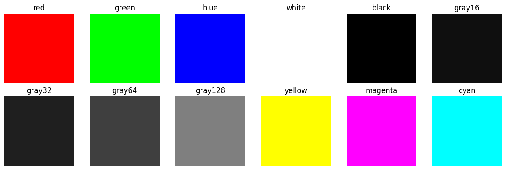
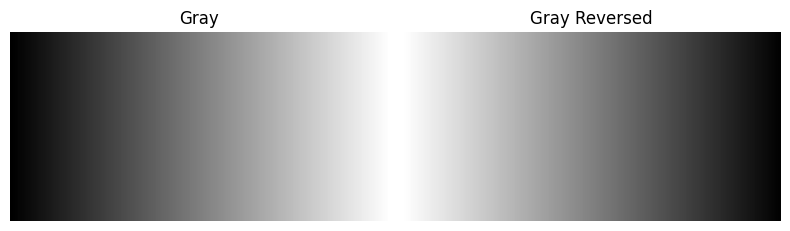
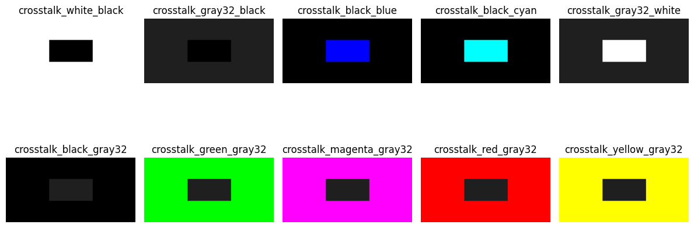
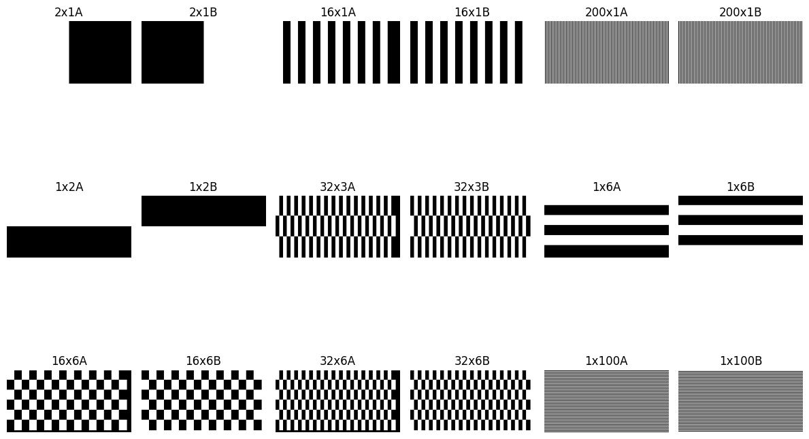
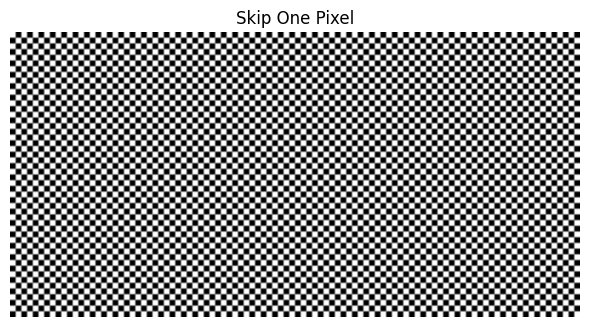

# Display Pattern Generator

A cross-platform application for generating various test patterns to check display functionality, appearance, and optical performance characteristics.

## Demo Images

### Solid Colors


- **Red, Green, Blue, White, Black, Gray16, Gray32, Gray64**: Basic color testing and color accuracy
- **Purpose**: Test color reproduction, identify dead pixels, check display uniformity, and evaluate grayscale levels.

### Gray Gradients


- **Gray16, Gray32, Gray64**: Fixed grayscale level testing
- **Gray Gradient**: Full grayscale gradient test
- **Reversed Gradient**: Inverted grayscale gradient test
- **Purpose**: Check gamma correction, color temperature, and grayscale reproduction.

### Crosstalk Patterns


- **White with Black Box**: Tests for pixel bleeding against white background
- **Black with Gray Box**: Tests for pixel bleeding against black background
- **Gray with Black Box**: Tests for pixel bleeding with gray background
- **Purpose**: Identify pixel bleeding and interference between adjacent pixels

### Grid Patterns


- **32x6, 32x3, 16x6**: Fine grid patterns for testing pixel alignment
- **2x1, 1x6, 1x2**: Coarse grid patterns for testing display geometry
- **Purpose**: Verify pixel alignment, check for geometric distortion

### Skip-One-Pixel Pattern


- **Checkerboard**: Pattern for testing individual pixel response
- **Purpose**: Check pixel-level rendering and response time


## Features

- Full-screen pattern display
- Multiple pattern types for different testing scenarios
- GUI interface with easy pattern selection
- Command-line interface for automated testing
- Pattern cycling with configurable timing
- Modular Python class for custom pattern generation

## Installation

1. Clone the repository:
```bash
git clone https://github.com/workingyifei/display-pattern-generator.git
cd display-pattern-generator
```

2. Create a virtual environment (recommended):
```bash
python -m venv venv
source venv/bin/activate  # On Windows: venv\Scripts\activate
```

3. Install dependencies:
```bash
pip install -r requirements.txt
```

## Usage

### Command-Line Mode
Run the application with specified width and height, for a 13-inches MacBook Air:
```bash
python pattern_generator.py --width 2560 --height 1664
```

### GUI Mode
Run the application in GUI mode:
```bash
python gui.py
```

### Burn-in Mode, loop all or specified patterns infinitely
Run the application in pattern loop mode:
```bash
python loop.py
```

- Press ESC to exit
- Patterns will cycle automatically every second

### Python Module
Use the `PatternGenerator` class to create custom patterns:
```python
from pattern_generator import PatternGenerator

# Create a generator with custom resolution
generator = PatternGenerator(width=1920, height=1080)

# Generate specific patterns
red_pattern = generator.generate_solid_color("red")
grid_pattern = generator.generate_grid(rows=6, cols=32)

# Generate all patterns
all_patterns = generator.generate_all_patterns()
```

## Display Defects 

This tool can help identify various display defects including:

### 1. Dead/Stuck Pixels
**Definition:** Dead pixels do not light up at all, resulting in a black spot on the screen. Stuck pixels remain permanently lit in one color (red, green, or blue).

  <!-- Replace with actual image URL -->

**Detection:** 
- Use solid color patterns (especially white) to identify dead pixels
- Use black pattern to identify stuck pixels

### 2. Color Accuracy
**Definition:** Color accuracy refers to how faithfully a display reproduces colors according to standard color spaces.

  <!-- Replace with actual image URL -->

**Detection:**
- Use RGB patterns to verify color reproduction
- Use grayscale patterns to check color temperature and gamma

### 3. Screen Uniformity
**Definition:** Screen uniformity refers to the consistency of brightness and color across the entire display.

  <!-- Replace with actual image URL -->

**Detection:**
- Use solid color patterns to check for brightness uniformity
- Use gray patterns to identify backlight bleeding

### 4. Response Time
**Definition:** Response time is how quickly a pixel can change from one color to another, affecting motion clarity.


**Detection:**
- Use alternating patterns to check pixel response time
- Use grid patterns to check for ghosting

### 5. Pixel Alignment
**Definition:** Proper positioning of pixels on a display. Misalignment can lead to visual artifacts, such as blurriness or distortion.


**Detection:**
- Grid patterns help visualize the alignment of pixels. When displayed, any misalignment will cause the lines to appear jagged or distorted.
- By examining the grid, users can determine if the pixels are correctly aligned.

### 6. Crosstalk/Interference
**Definition:** Unwanted transfer of signals between adjacent pixels, leading to ghosting or blurring effects.


**Detection:**
- Crosstalk patterns highlight the effects of crosstalk
- Use alternating patterns to check for interference between pixels

## Implementation Details

The project consists of several components:

1. **pattern_generator.py**: Core Python class for generating test patterns
2. **gui.py**: PyQt5-based graphical user interface
3. **loop.py**: Command-line tool for cycling through patterns
4. **Pattern_Demo.ipynb**: Jupyter notebook demonstrating pattern generation

## Contributing

Contributions are welcome! Please feel free to submit a Pull Request.

## License

This project is licensed under the MIT License - see the LICENSE file for details.
